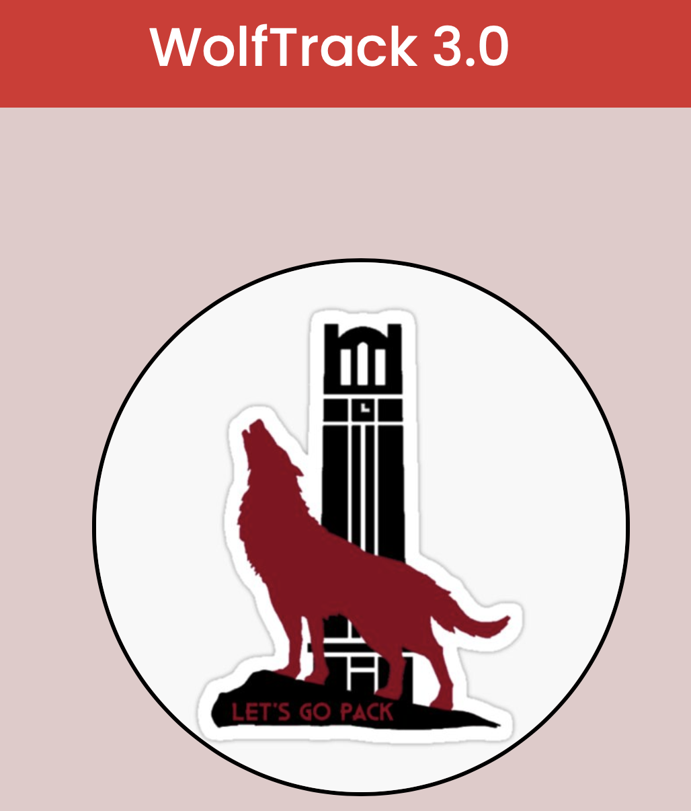

<h1><b>WolfTrack 3.0</b></h1>

[Demo Link](https://drive.google.com/file/d/1qGqChBA63N_6k9n5cbyz1hqmli08SUUZ/view)

---

[](https://zenodo.org/badge/latestdoi/428810078)
[](https://github.com/nehajaideep/WolfTrack3.0/releases/tag/wolftrack)
[](https://github.com/nehajaideep/WolfTrack3.0/actions/workflows/main.yml)
[](https://codecov.io/gh/nehajaideep/WolfTrack3.0)

[](https://github.com/nehajaideep/WolfTrack3.0)
[](https://github.com/nehajaideep/WolfTrack3.0)
[](https://github.com/nehajaideep/WolfTrack3.0)
[](https://github.com/nehajaideep/WolfTrack3.0)

---

&emsp; &emsp; &emsp; &emsp; &emsp; &emsp; &emsp; &emsp; &emsp; &emsp; &emsp;  </img>

---
# ❓ Why WolfTrack3.0 ❓

Do you find yourself applying to too many companies and losing track of your time? 

Do you want to hear from your coworkers or experts? 

WolfTrack 3.0 aids in the planning and organization of job applications in a chronological manner so that you can conveniently track job applications, receive professional advice, and land your dream job. We keep track of job applications, job descriptions, locations, wages, dates, and notes, among other things.

&emsp; &emsp; &emsp; &emsp; &emsp; &emsp; &emsp; &emsp; &emsp; &emsp; &emsp; 

**So, let's go get that job! 😎**

---
## 🥊 Punch Line


https://user-images.githubusercontent.com/66715000/144538638-acc75fa1-db5b-49a1-a5d0-9b3bbc79cf89.mp4


---

## 📚 Technology Stack
&emsp; &emsp; &emsp; &emsp; &emsp; &emsp; <code><a href="https://developer.mozilla.org/en-US/docs/Glossary/HTML5" target="_blank"></a></code>
<code><a href="https://flask.palletsprojects.com/en/1.1.x/" target="_blank"></a></code>
<code><a href="https://developer.mozilla.org/en-US/docs/Glossary/HTML5" target="_blank"></a></code>
<code><a href="https://developer.mozilla.org/en-US/docs/Web/CSS" target="_blank"></a></code>
<code><a href="https://www.javascript.com/" target="_blank"></a></code>
<code><a href="https://getbootstrap.com/" target="_blank"></a></code>
<code><a href="https://www.mysql.com/" target="_blank"></a></code>
<code><a href="https://aws.amazon.com/" target="_blank"></a></code>

<p align="center"> Python |  Flask |  HTML | CSS | JavaScript | BootStrap | MySQL | AWS </p> 

## 🎛️ Version Control Tools
 <p align="center">
   
</p>

       
## 🧰 Tools

&emsp; &emsp; &emsp; &emsp; &emsp; &emsp; &emsp;

- #### We have created an entire CI pipeline which includes all the stages including Code Analysis, Style checkers, Code Coverage, Code Assemble and Docker Image        Build, readily available to run the image on any server without manually setting up the environment.
- [Github WorkFlow YAML](https://github.com/nehajaideep/WolfTrack3.0/blob/Group10StableBranch/.github/workflows/main.yml) | [Dockerfile](https://github.com/nehajaideep/WolfTrack3.0/blob/Group10StableBranch/Dockerfile) | [Prettier Code Formatter](https://marketplace.visualstudio.com/items?itemName=esbenp.prettier-vscode) | [JS-HTML-CSS Formatter](https://marketplace.visualstudio.com/items?itemName=lonefy.vscode-JS-CSS-HTML-formatter) | [Flake8](https://github.com/nehajaideep/WolfTrack23.0/blob/Group10StableBranch/.github/workflows/main.yml)

### Third-Party Tools

- [AWS Relational Database Service-RDS](https://docs.aws.amazon.com/AmazonRDS/latest/UserGuide/Welcome.html)
  -  The AWS Database is used as a primary DB by the location. The application interacts with the DB and no additional steps are required from the users. For any contributors or future developers, please mail to wolftrackse@gmail.com to get your AWS IAM user account details to connect to AWS RDS.
- [Microsft Power BI](https://docs.microsoft.com/en-us/power-bi/)
- [Highcharts](https://www.highcharts.com/)

---

## 💻 Getting Started & Installation:

  - ### Prerequisite:
      - Download [Python3.x](https://www.python.org/downloads/).

   - ### Installation:
      E.g If you downloaded `Python 3.8.7` above, then

      **Steps to setup virtual environment**
     - Create a virtual environment:

        `python3.8 -m venv test_env`
    
     - Activate the virtual environment: 

        `source test_env/bin/activate`
    
     - Build the virtual environment:(must be present in [project root directory](https://github.com/nehajaideep/WolfTrack2.0))

        `pip install -r requirements.txt`

  - ### Run Instructions

     **To run/test the site locally:**

     - Clone [WolfTrack github repo](https://github.com/nehajaideep/WolfTrack2.0).

     - Navigate to [project directory](https://github.com/nehajaideep/WolfTrack2.0).
  
     - Run `python main.py` or `python3 main.py` <br> <br>
       If there is a certificate error coming up for nltk stopwords download: <br>
       - search for "Install Certificates.command" in finder and open it. Its a script that will install required Certificates. <br>
       - Run the above command again.

     - Site will be hosted at:
       `http://127.0.0.1:5000/`
 
  - ### Application Deployed on a sandbox server
     
     - You can access the application on the url
       `https://harshb.pythonanywhere.com/login`
    
  ## 🚢 Run locally using Docker
Our application is docker-compatible configured and you have to follow below steps to run the docker on local:<br>
Note : Make sure you have a docker desktop or docker client installed on your system
  * [Docker Desktop Installation Guide](https://docs.docker.com/get-docker/)

1. Clone the repository
```
git clone https://github.com/nehajaideep/WolfTrack3.0.git
```
2. Go the the repository
```
cd WolfTrack3.0
```
3. Run the docker build command
```
docker build --tag wolftrackv3:1.0 .
```
4. Run the built docker image on local Container
```
docker run -dp 5000:5000 wolftrackv3:1.0
```

5. Test the backend application using below api
```
GET localhost:5000/login
Response :- "Login Page will appear"
```

6. Tag the Deployable image
```
docker tag wolftrackv2:1.4 akhil/wolftrackv3:1.0
```

7. Push the Deployable tagged image to the DockerHub Cloud Image Repository
```
docker push akhil/wolftrackv3:1.0
```

8. Below DockerHub Repository where the readily deployable Image is available


---

[Class/Functions Documentation](https://github.com/nehajaideep/WolfTrack3.0/blob/Group10StableBranch/docs/WolfTrack3.0_Documentation.pdf)     

---

## 📔 Code Coverage

It is part of the [Github Workflow Build](https://github.com/nehajaideep/WolfTrack2.0/runs/4099439944?check_suite_focus=true)

---
## 🛤️ Roadmap

### Phase 1 WolfTrack:

- [x] Create database ER diagram
- [x] Create SQL DML and DDL queries
- [x] Create Dashboard Page
- [x] Create Login Page
- [x] Create Signup Page
- [x] Setup Flask
- [x] Add Unit testing
- [x] Add Error Handling mechanisms
- [x] Mock of Job Application Map using Power BI

### Phase 2 WolfTrack 2.0:

- [x] Resume Parser and Analyzer
- [x] Email Notifcation after adding new job profile to list
- [x] Upload and maintaining resume versions
- [x] Send remainder mails for deadlines
- [x] Share your profile with others
- [x] Creation of Docker image 
- [x] Readily deployable image in docker registry


### 🏁 Phase 3 WolfTrack 3.0:

☑️  Two Type Login Application - Admin and User.<br>
☑️  Resume Review, Comment, Download and Like by Admin.   
☑️  Comments given by Admin are sent as email to the user. <br>
☑️  Cronjob for pending application deadlines as email notification. <br>
☑️  Implemented web scraping to find relevant jobs according to user's profile and recommend him <br>
☑️  Daily Goal Check to keep track of number of jobs applied and to apply <br>
☑️  Customizable Daily Target Field <br>
☑️  Parse Resume Document with other extensions <br>
☑️  Recommend jobs by matching the resume with open jobs <br>

### 🔭 Phase 4 WolfTrack 4.0 (Future Scope):

- [ ] Configure Cron-Job for reminder as SMS notification
- [ ] Model improvement of resume analyzer 
- [ ] Customization of job recommendations
- [ ] Direct application links to jobs in the recommendation list
- [ ] Online chat with expert
- [ ] Resume template editor

---

## ✍️ Contributions
Please refer to the [CONTRIBUTING.md](https://github.com/nehajaideep/WolfTrack2.0/blob/Group10StableBranch/CONTRIBUTING.md) if you want to contrbute to the Wolftrack 3.0 source code. Follow all the guidelines mentioned and raise a pull request for the developers to review before the code goes to the main source code.

---

## :handshake: Contributors

<table>
  <tr>
    <td align="center"><a href="https://github.com/niveditalodha"><br /><sub><b>Nivedita Lodha</b></sub></a></td>
    <td align="center"><a href="https://github.com/akhilkumarmengani"><br /><sub><b>Akhil Kumar Mengani</b></sub></a><br /></td>
    <td align="center"><a href="https://github.com/umagnanasundaram2128"><br /><sub><b>Uma Gnanasundaram</b></sub></a><br /></td>
    <td align="center"><a href="https://github.com/vamshi-chidara"><br /><sub><b>Vamshi Chidara</b></sub></a><br /></td>
    <td align="center"><a href="https://github.com/nehajaideep"><br /><sub><b>Neha Kotcherlakota</b></sub></a><br /></td>
  </tr>
</table>

---
